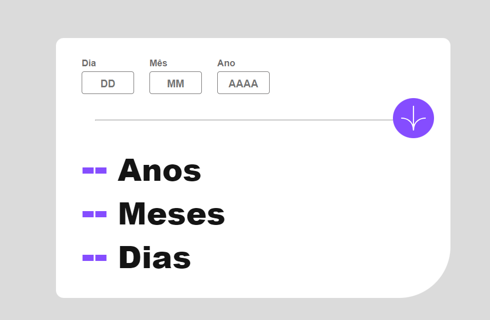
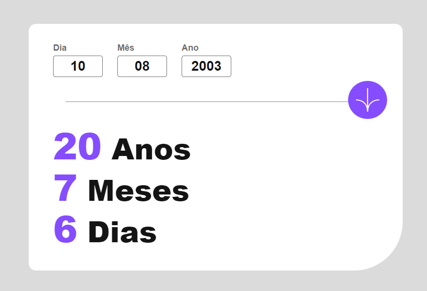

# Age_Calculator

O projeto consiste em uma calculadora de idades, que recebe a data de nascimento do usuário e calcula sua idade com base no dia atual. Feito em HTML, CSS e JavaScript, utilizando da metodologia Mobile First para seu desenvolmento.

## Screenshots

## Dificuldades

A maior dificuldade foi pensar na lógica por trás da conta das datas. Não é a primeira vez que faço uso do Objeto Date, mas é a primeira vez que uso de uma forma mais complexa, então tive um pouco de dificuldade com isso. Mas no fim, o aprendizado foi muito bom e gostei bastante de como ficou o resultado.

## Aprendizados

* Maior familiaridade com o JS, em especial o Objeto Date;
* Desenvolvimento das habilidades em HTML e CSS;
